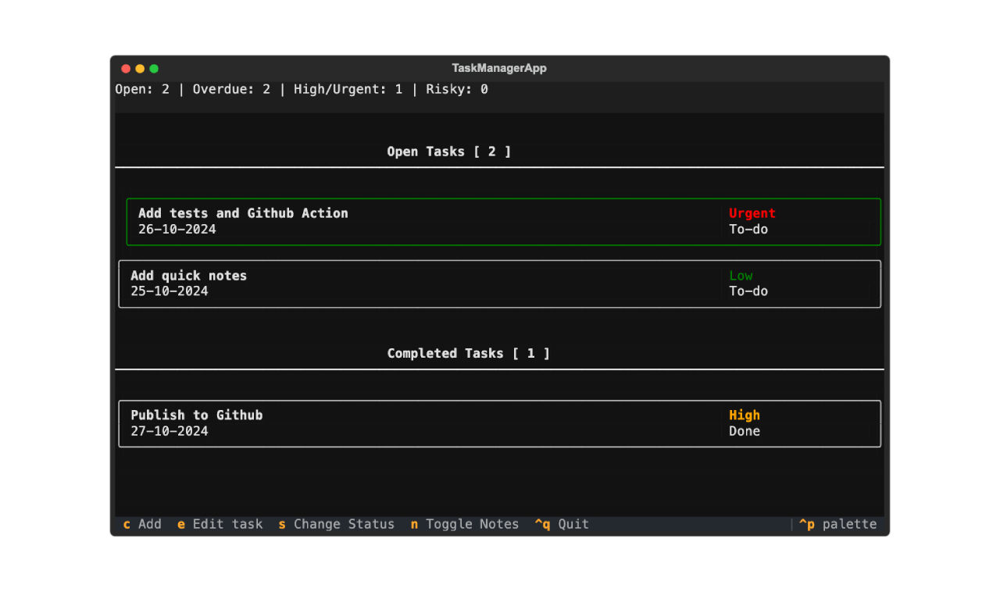

# Task Manager TUI

Task Manager TUI is a terminal-based task management application built using Python and [Textual](https://github.com/Textualize/textual). It allows users to create, modify, and organize tasks from terminal.

## Features

- Add tasks with a title, description priority, and due date.
- Edit tasks.
- Navigation using the keyboard.
- QuickNote box

## How to Use

1. Fork the repository.
2. Install [Textual](https://github.com/Textualize/textual):
`pip install textual` 
3. Run tasks.py in the folder with python:
`Python3 tasks.py`

## Changelog

### [1.0.0] - 2024-10-27
#### Added
- Initial release with task creation, edit, and quick notes.
  

## TODO

- [ ] Add tests and improve coverage.
- [ ] Implement recurring tasks feature.
- [ ] Add filtering options for tasks (priority, status, due date, etc.).
- [ ] Implement snooze task feature.
- [ ] Enhance keyboard navigation with more shortcuts.
- [ ] Implement bulk editing for tasks.
- [ ] Add a note panel with Markdown support.
- [ ] Integration with external tools like Slack, Linear, etc.
